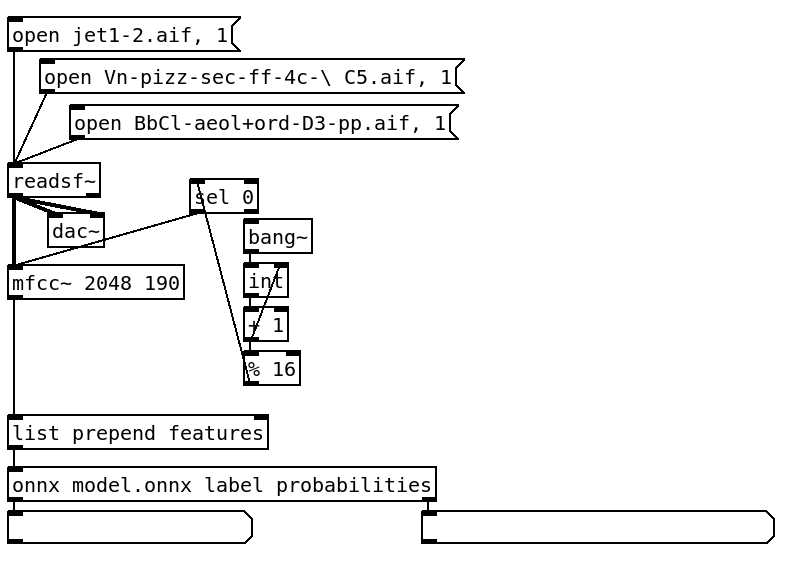

# `onnx`

## Overview

**ONNX** (Open Neural Network Exchange) is a standard format for representing machine learning models. It allows models trained in one framework (e.g., PyTorch, TensorFlow) to be run in another, enabling interoperability and deployment flexibility.

`onnx` is a **lightweight Pure Data external** that lets you run [ONNX](https://onnx.ai/onnx/intro/) models directly inside Pd. Its small size makes it particularly suitable for **pd4web** projects where minimal memory footprint and minimal size are essential.

## Features

- Load ONNX models directly from file. 
- Query input/output tensors and their shapes. 
- Support for multiple numeric tensor types: `float32`, `float64`, `int32`, `int64`. 
- Measure inference time with optional timing mode. 
- Lightweight: uses the small [`libonnx`](https://github.com/xboot/libonnx) library, ideal for web deployment. 
- Checks for operator compatibility against a fixed opset (default: 24).

## Usage

### Creating the Object

1) Create the model using `[onnx model.onnx]`;
2) Use `dump tensors_inputs` and `dump tensors_outputs` message to check the name of the inputs and outputs.
3) Recreate the object and set the outputs tensors you want to see, for example: `[onnx model.onnx label probabilities]`.
4) Use `list prepend mfcc`, where `mfcc` is a name of one `tensors_inputs` to send messages and do the inference.

    

### Methods

#### Config 

* `set time_inference 1/0`: Toggle time inference in microsseconds (not milisseconds).

#### **Info**
* `dump tensors_inputs`: Print a description of all tensors *inputs* from the model.
* `dump tensors_outputs`: Print a description of all tensors *outputs* from the model.
* `dump compatibility`: Check the compatibility of all the operators of the model. 

## Notes

* Only supports numeric tensors for inputs for now (`float32`, `float64`, `int32`, `int64`).
* Output tensors are returned as Pd lists.
* Lightweight and small, ideal for embedding in `pd4web` applications.
